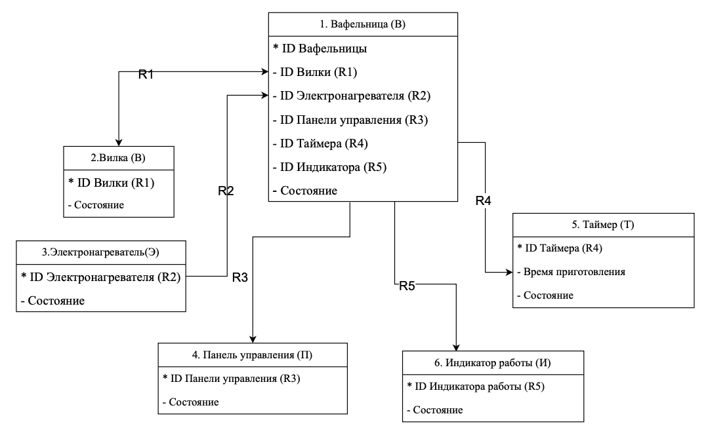
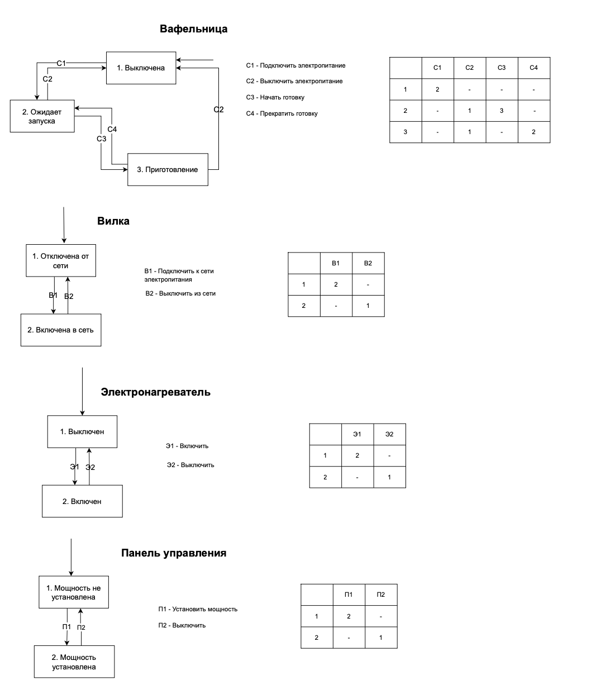
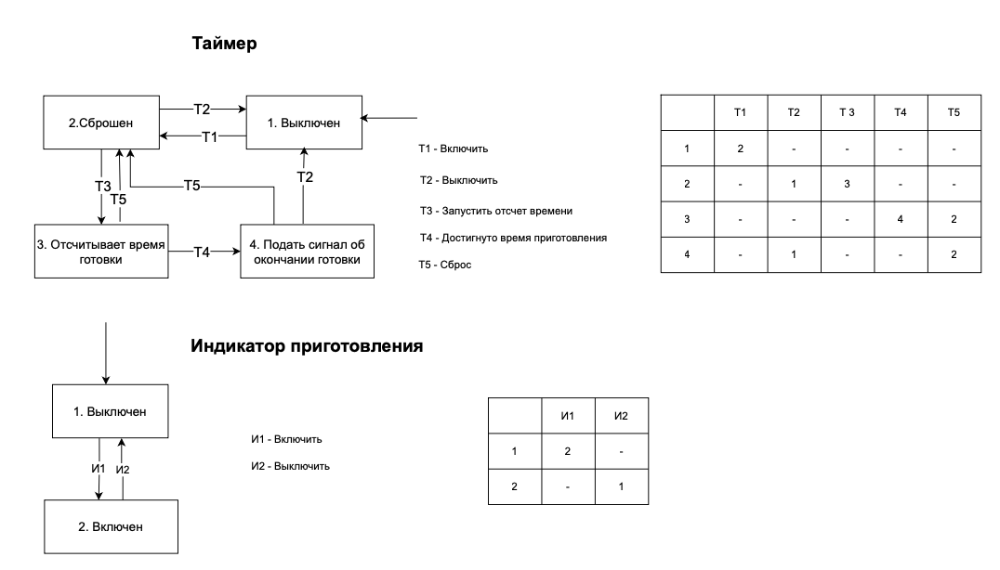
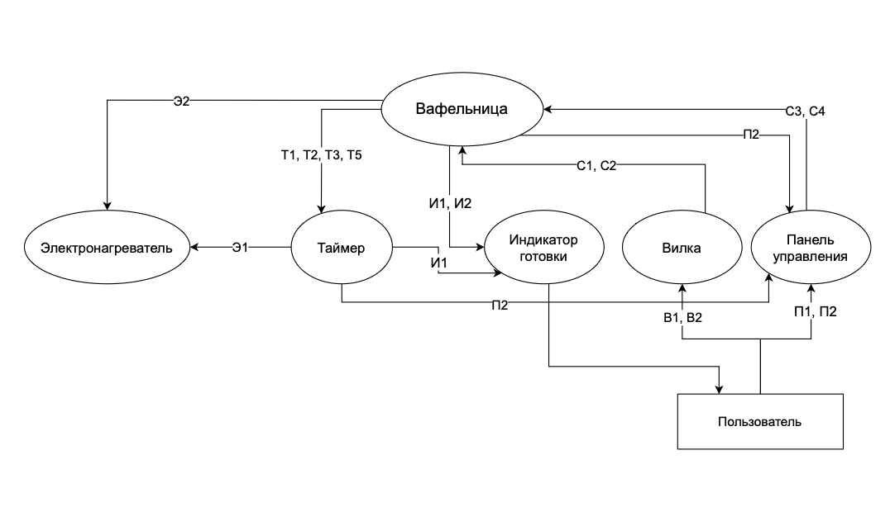
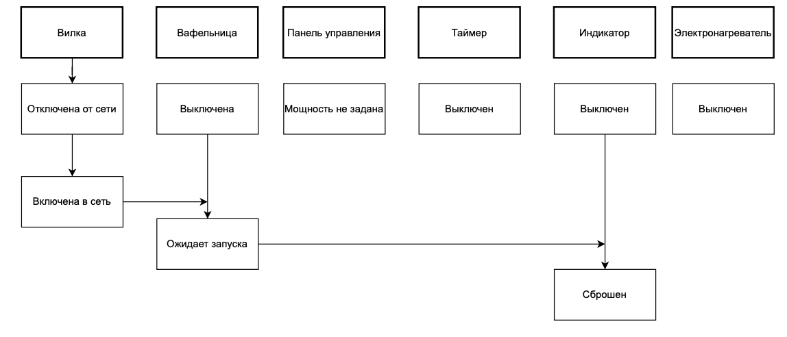
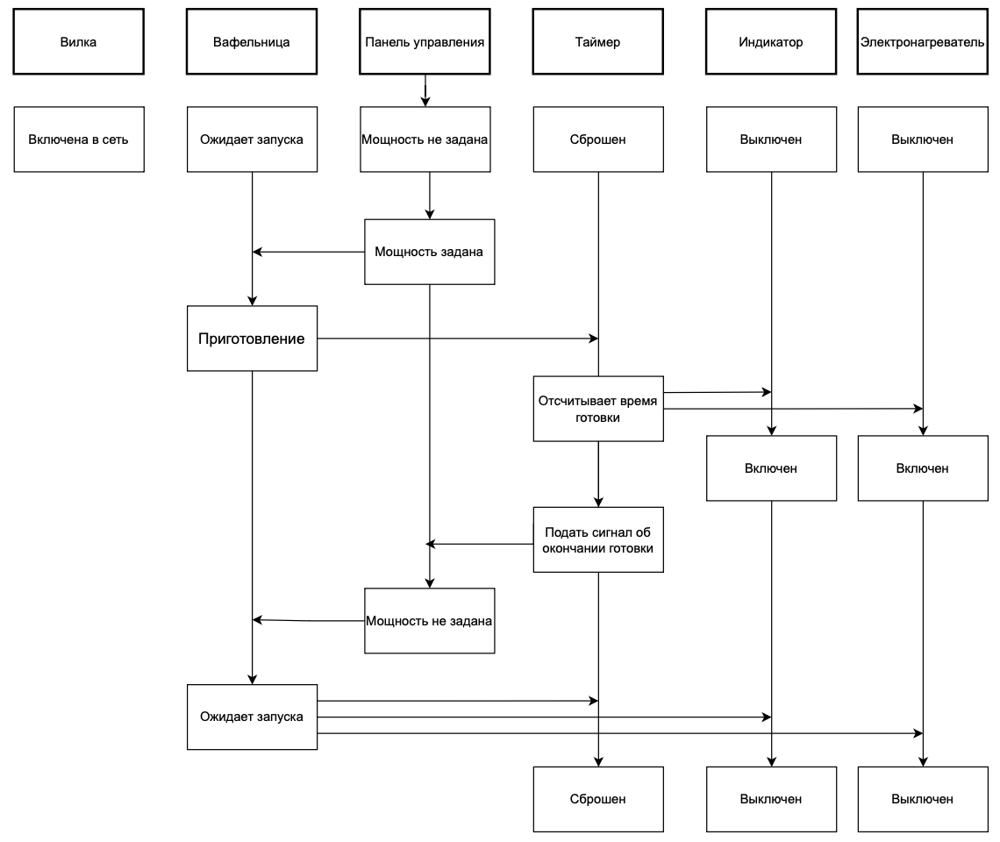
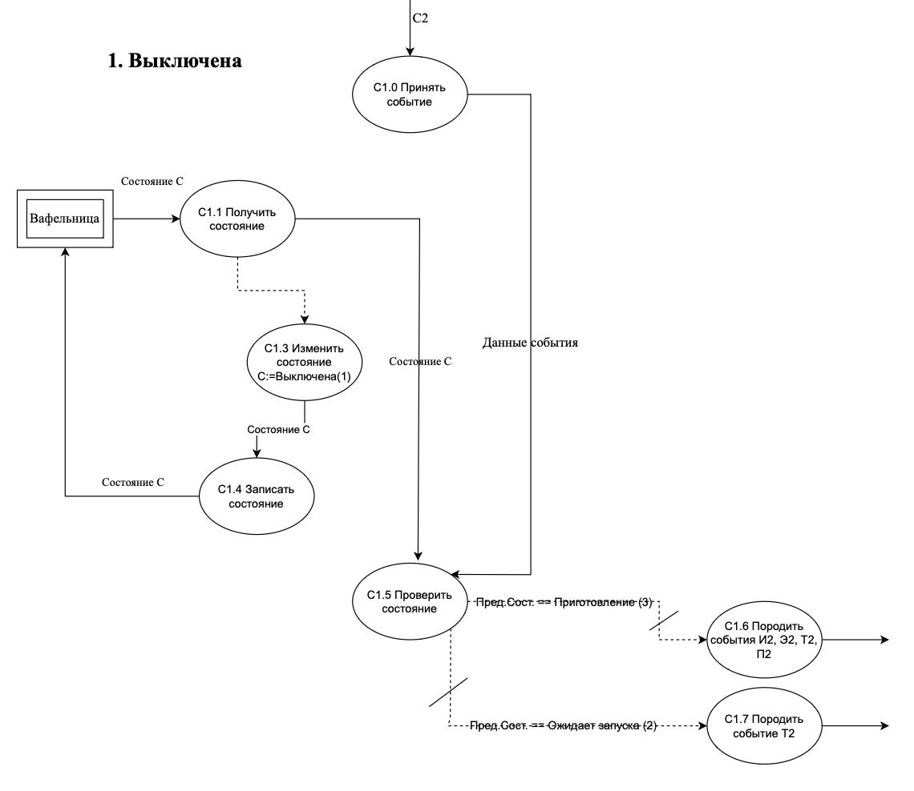
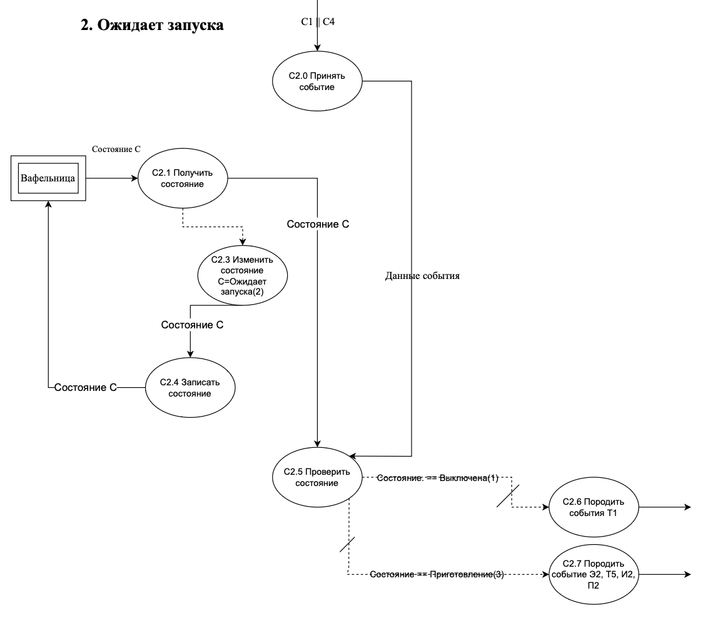

# Лабораторная работа №5. 
Написать документы для объектно-ориентированного проектирования. Нужна информационная модель, МВО, ДПС, каналы управления и потоки событий-данных.

## Нужно сделать
- Диаграмма переходов состояний (`ДПС`)
- Таблица переходов состояний (`ТПС`)
- Диаграмма потоков данных действий (`ДПДД`)
- Модель взаимодействие объектов (`МВО`)
- Каналы Управления (`КУ`)
- Информационная модель (`ДСС`)

## Информационная модель

## Диаграмма переходов состояний и ТПС

## Модель взаимодейтвия объектов

## Каналы управления
жизнь боль

## Диаграмма поток данных действий

